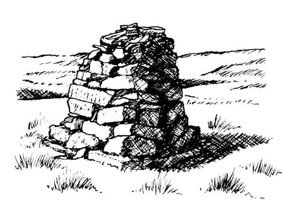

class: top, left
background-image: url(background.jpg)
layout: true


???
Notes for presentation
---

# Slide

- bullet 1

.left[]
--

- bullet 2


```java

public static void main(String[]args){
  System.out.println("hello remark");
}

```
---


# The revenge

- test
